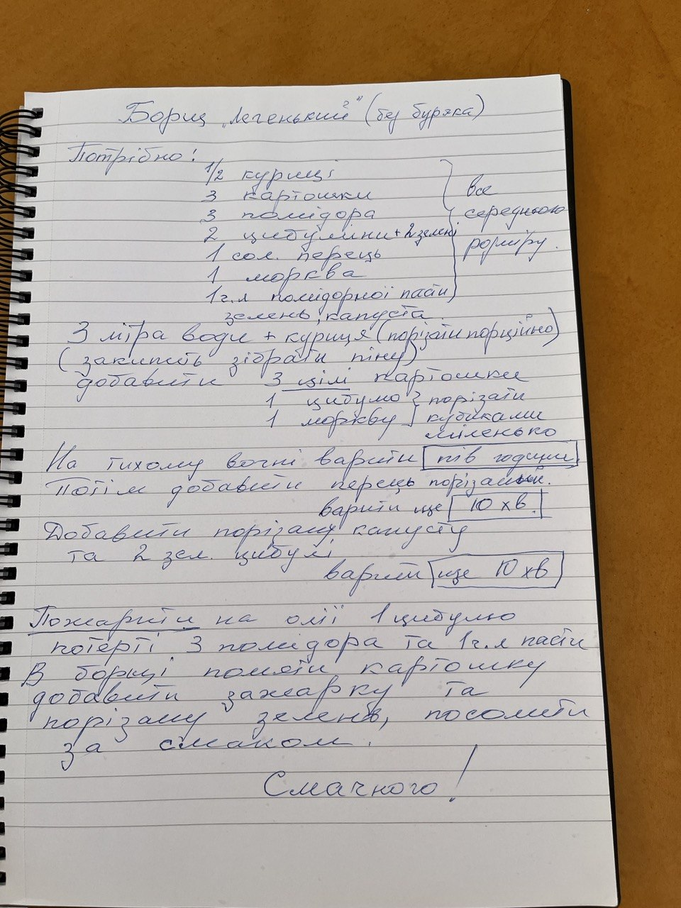

# Light Borscht (without beetroot)

## Ingredients

- 1/2 chicken
- 3 potatoes
- 3 tomatoes
- 2 onions + 2 spring onion
- 1 carrot
- Salt, pepper
- 1 tbsp tomato paste
- Greens, cabbage

> All vegetables: medium size (no precise measurement)

## Instructions

1. Add chicken (cut into pieces) to 3 liters of water.  
   Bring to a boil and skim off the foam.

2. Add:
   - 3 potatoes (add a whole potato)
   - 1 onion (cut into small cubes)
   - 1 carrot (cut into small cubes)

3. Simmer on low heat for **1/2 hour**.

4. Add chopped pepper and simmer for **10 minutes**.

5. Add chopped cabbage and 2 chopped spring onion.  
   simmer for another **10 minutes**.

6. Separately, sauté in oil:
   - 1 onion grated
   - 3 tomatoes
   - 1 tbsp tomato paste

7. Mash potatoes in the borscht.
   Add the sautéed mixture to the soup.

8. Season with salt and pepper to taste.
9. Serve with chopped greens.

---

**Enjoy your meal!**

---

This is perhaps my personal favourite Borscht recipe of mine. Light, tasty, and relatively fast to cook :)